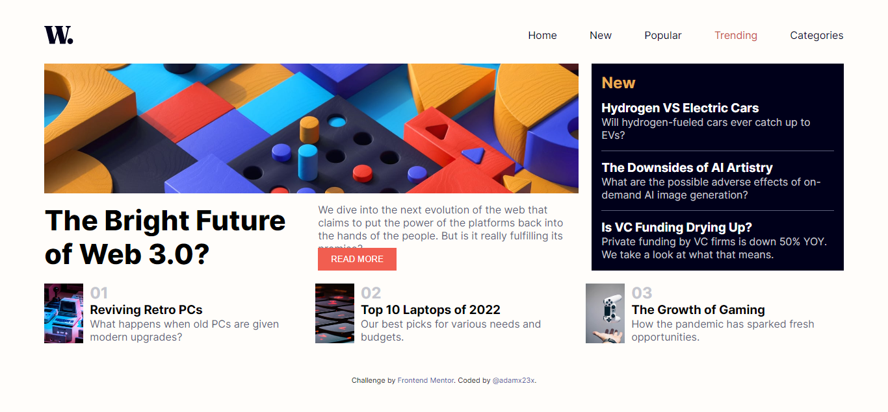

# Frontend Mentor - News homepage solution

This is a solution to the [News homepage challenge on Frontend Mentor](https://www.frontendmentor.io/challenges/news-homepage-H6SWTa1MFl). Frontend Mentor challenges help you improve your coding skills by building realistic projects. 

## Table of contents

- [Overview](#overview)
  - [The challenge](#the-challenge)
  - [Screenshot](#screenshot)
  - [Links](#links)
  - [My process](#my-process)
  - [Built with](#built-with)
  - [Continued development](#continued-development)
  - [Useful resources](#useful-resources)
  - [Author](#author)
  - [Acknowledgments](#acknowledgments)

## Overview

### The challenge

Users should be able to:

- View the optimal layout for the site depending on their device's screen size
- See hover states for all interactive elements on the page
- **Bonus**: Toggle the mobile menu (requires some JavaScript)

### Screenshot

### Links

- Solution URL: [https://github.com/adamx23x/News-homepage-main](https://github.com/adamx23x/News-homepage-main)
- Live Site URL: [https://adamx23x.github.io/News-homepage-main/](https://adamx23x.github.io/News-homepage-main/)

## My process

### Built with

- Semantic HTML5 markup
- CSS custom properties
- sass/scss
- Flexbox
- Desktop-first workflow

### Useful resources

- [Google](https://google.com)
- [Youtube](https://www.youtube.com)

## Author

- Github - [Adams Ibrahim](https://github.com/adamx23x)
- Frontend Mentor - [@adamx23x](https://www.frontendmentor.io/profile/@adamx23x)
- Twitter - [@adamx23x](https://www.twitter.com/@adamx23x)

## Acknowledgments

I want to thank Me